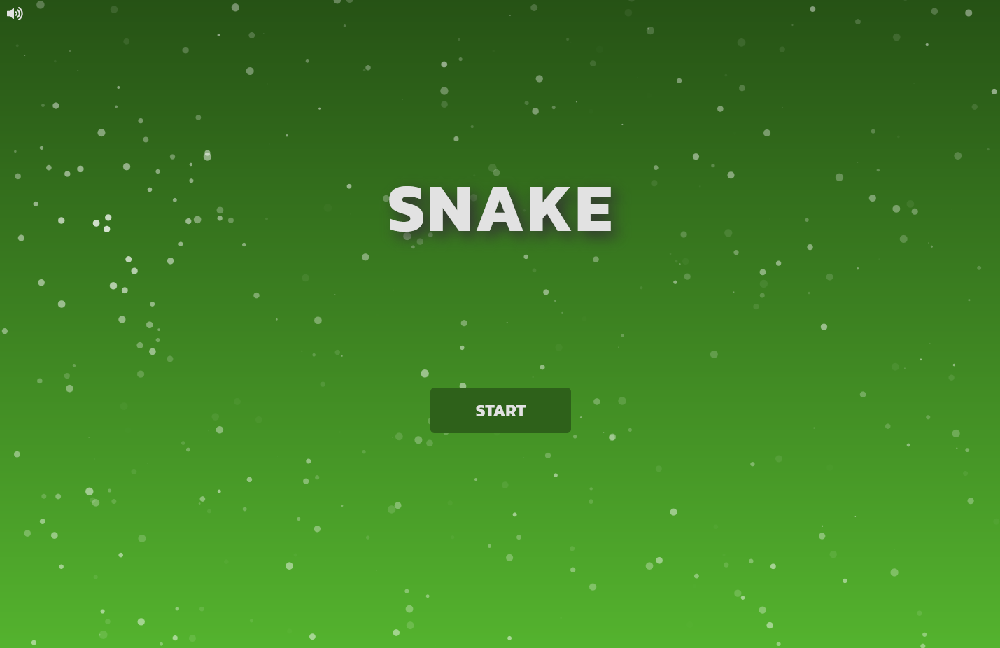
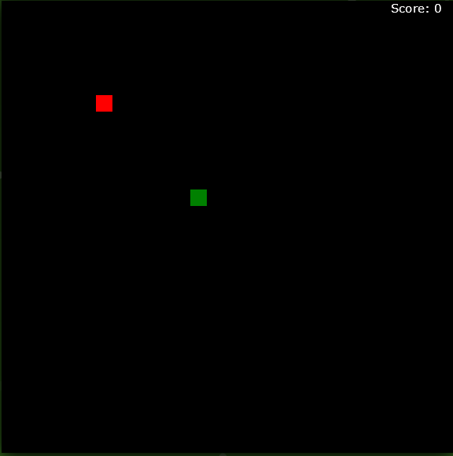

# Snake

This site was made to let users enjoy a simple snake game with simple visualization. Snake will be targeted towards those who can enjoy themselves a simple, but yet, fun game. The game let's the player move the snake and collect score by eating apples.

---

## Features

### Current Features

- __Landing Page__

    - The landing page is basically the main menu for the snake game. It features a heading to show the user what the site is about. Under the heading is the start button, which starts the game whenever pressed. Pressing the icon in the top right will mute and unmute the music playing in the background, this will allow users to control an action according to their mood. There's' also particles moving around for aesthetic purposes.
    - The landing page tells the user what everything does in a simple way while still looking good.

- __Home Link__

    - This Link brings you back to the landing page making it easier and provides more options while at the same time working as the header displaying the games name.

- __Game Area__

    - The game area is where the snake game is played. The user will easily see the area as it sticks out from the background of the site.
    - The user will be able to control the snake and collect score by eating the red apples.
    - The score is counted in the top right corner and updates everytime the player eats an apple.

### Future Features

- __High Score__

    - This will show the players highest score up to date.

- __Time Played__

    - This feature will show the player how long he/she has played the game he/she is currently playing.
    - When losing the time resets.

## Testing 

__Landing Page__

On the landing page the user is greeted with the header "SNAKE" together with an interactive start button to start the game and nice moving particles in the background.

__Home Link__
The home link brings you back to the the landing page.

__Game Area__
The game area is a 575x575 box where the snake game is played. The area contains 24x24 tiles and the snake moves from tile to tile using the arrow keys. Apples can spawn randomly within these tiles and eating one will add one more block to the back of the snake making it longer.

### Compatibility

- This game is only compatible with computers as it uses the arrow keys to move the snake.
- Minimum compatible screen size: 580x700.

### Validator Testing 

- HTML
  - **index.html** No errors were returned when passing through the official [W3C validator](https://validator.w3.org/nu/?showsource=yes&doc=https%3A%2F%2F8000-black-partridge-wb61a4qe.ws-eu14.gitpod.io%2Findex.html)
  - **play_area.html** No errors were returned when passing through the official [W3C validator](https://validator.w3.org/nu/?showsource=yes&doc=https%3A%2F%2F8000-black-partridge-wb61a4qe.ws-eu14.gitpod.io%2Fplay_area.html)
- CSS
  - No errors were found when passing through the official [(Jigsaw) validator](https://jigsaw.w3.org/css-validator/validator?uri=https%3A%2F%2F8000-black-partridge-wb61a4qe.ws-eu14.gitpod.io&profile=css3svg&usermedium=all&warning=1&vextwarning=&lang=en)
- JavaScript
    - No errors were found when passing through the official [Jshint validator](https://jshint.com/)
        - The following metrics were returned:
        - There are 12 functions in this file.
        - Function with the largest signature takes 2 arguments, while the median is 0.
        - Largest function has 21 statements in it, while the median is 5.
        - The most complex function has a cyclomatic complexity value of 11 while the median is 2.

### Unfixed Bugs
- When the snake is moving straight and the player changes the direction to either left or right of the snake followed by changing the direction towards the tail instantly will cause the snake to move into its own tail.

## Deployment

  - The site was deployed to GitHub pages. The steps to deploy are as follows: 
  - In the GitHub repository, navigate to the Settings tab 
  - From the source section drop-down menu, select the Master Branch
  - Once the master branch has been selected, the page will be automatically refreshed with a detailed ribbon display to indicate the successful deployment. 

The live link can be found here - https://ericantebo.github.io/Snake/

## Credits

### Content

- All of the icons used were taken from [Font Awesome](https://fontawesome.com/)
- Generally helpful whenever I forget about something. Link: [w3schools](https://www.w3schools.com/)
- The particles on the both pages was taken from [particles.js](https://vincentgarreau.com/particles.js/)
- Multiple instructions and tutorials was used when making this snake game. Links: [educative](https://www.educative.io/blog/javascript-snake-game-tutorial), [instructables](https://www.instructables.com/How-to-Make-a-Snake-Game-in-JavaScript/), [Youtube tutorial](https://www.youtube.com/watch?v=QTcIXok9wNY)

### Media

- The background music on the landing page was taken from [fesliyanstudios](https://www.fesliyanstudios.com/)
 
